Projeto realizado pelos alunos: Ademir Rocha, Cristina Gonçalves e Rosemary Ramos.


## Sistema Proposto

Crie um sistema (modo texto) orientado a objetos em Python que contenha as diversas classes do projeto em grupo proposto... 

## Sistema Criado

Sistema de cadastro de alunos, Disciplinas, Provas, Notas de Provas de uma escola.

## Dados

O sistema possui alguns dados ficticios ja cadastrados.

Obs: O sistema não possui um banco de dados. Então ao sair do programa todos 
os dados cadastrados serão perdidos. 


## Usando o sistema

Para rodar oprograma acesse um prompt de comando ou CMD na pasta do projeto e 
execute a linha de comando abaixo.

```
$ python app.py
```

Após o comando acima abriará a tela do sistema, apartir daí é só ir digitando 
as opções de menus e realizando os processos de Cadastrar, Listar e Pesquisar.

### Exemplo de Conteudo apresentado na tela do sistema

Menu principal

```


                                Olá, bem vindo ao sistema da escola!


##############################################################################################
                                MENU PRINCIPAL

                                1   ->    Cadastros
                                2   ->    Listar
                                3   ->    Pesquisar
                                9   ->    Limpar Tela
                                x   ->    Sair do Sistema


                               Digite o valor do menu: 1


##############################################################################################
                                SUBMENU -> CADASTROS

                                1   ->   Cadastrar Aluno
                                2   ->   Cadastrar Disciplina
                                3   ->   Cadastrar Prova
                                4   ->   Cadastrar Notas de uma prova
                                0   ->   Retornar ao menu anterior


                               Digite o valor do submenu: 1


##############################################################################################
                                CADASTRO DE ALUNOS

------------- Digite o nome:


```

Para ver outros exemplos de telas veja as imagens dentro da pasta exemplos.


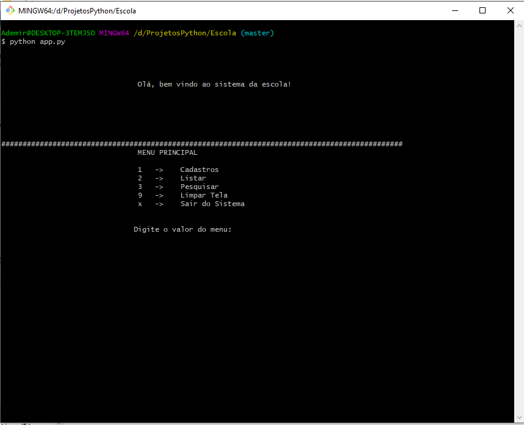
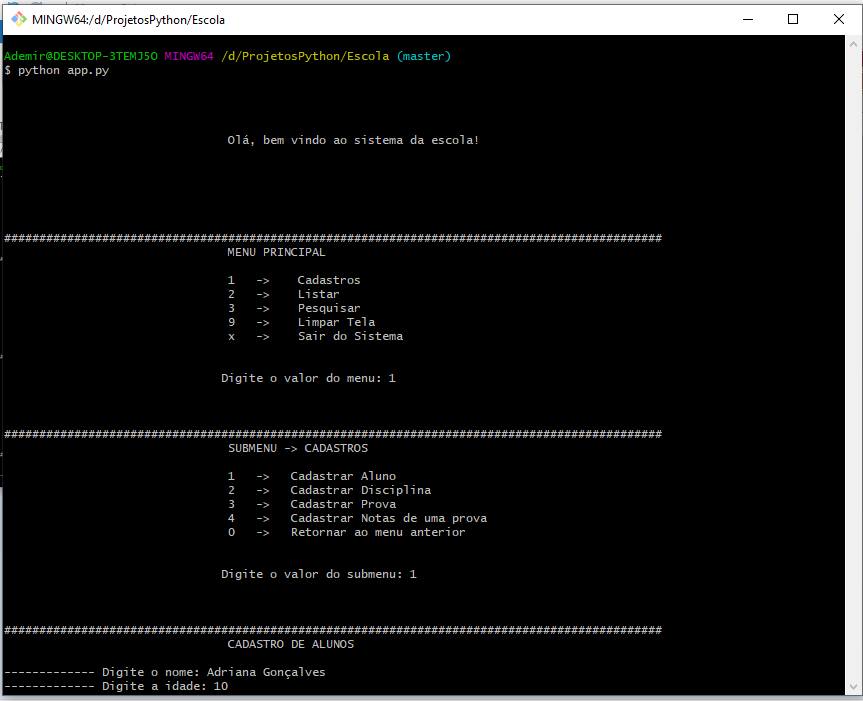
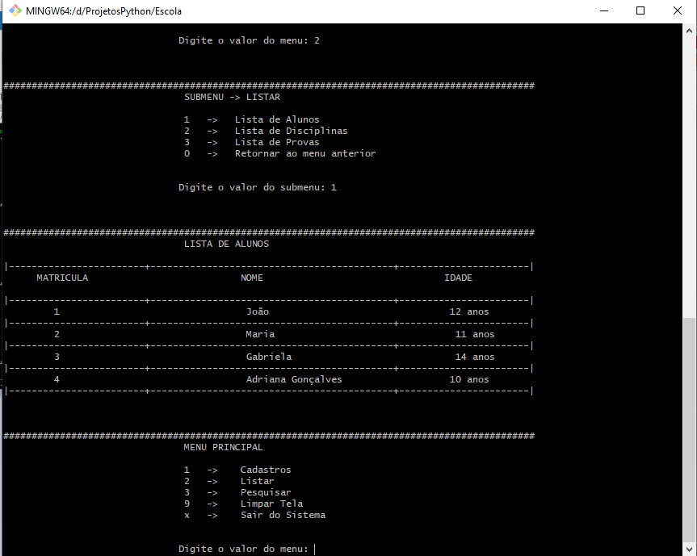
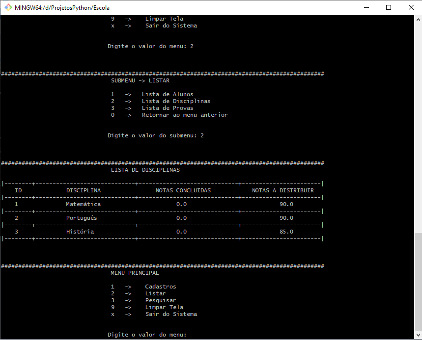
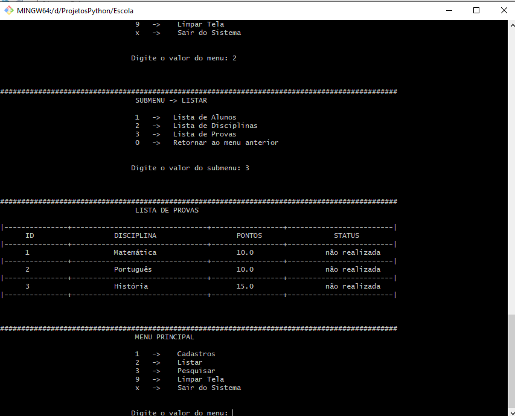
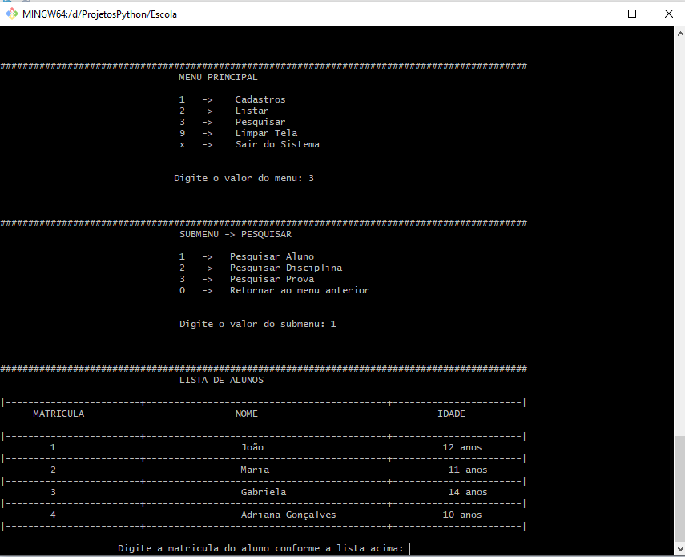
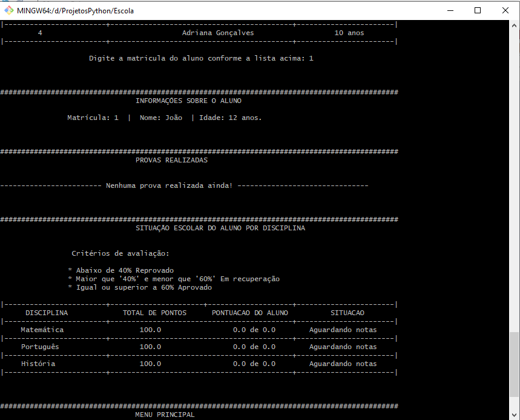
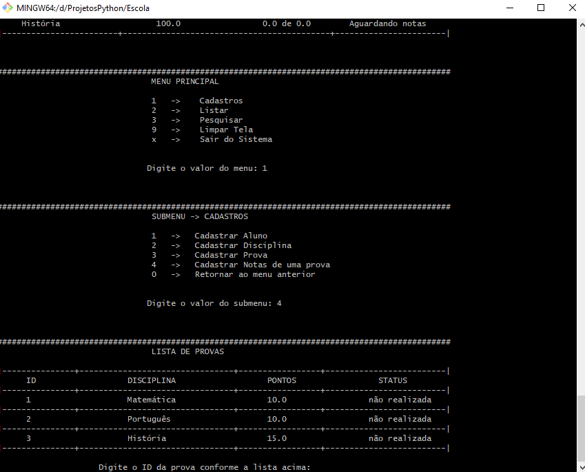
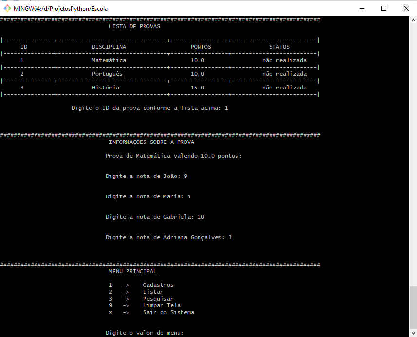
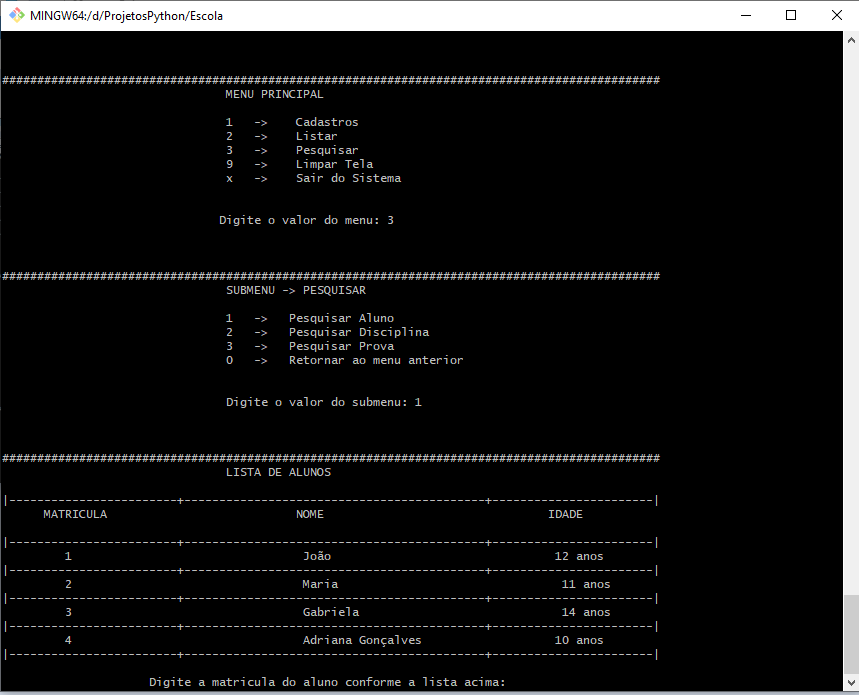
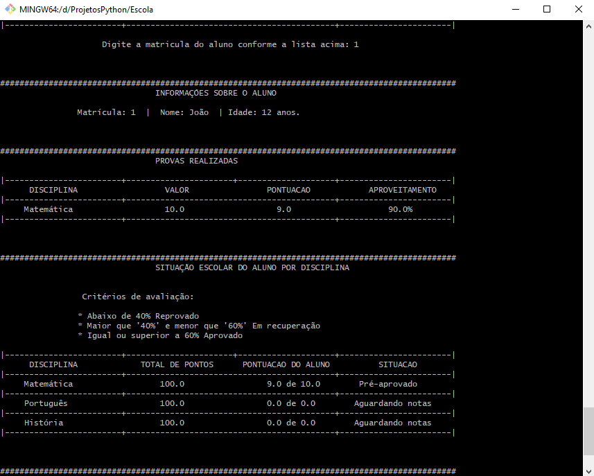